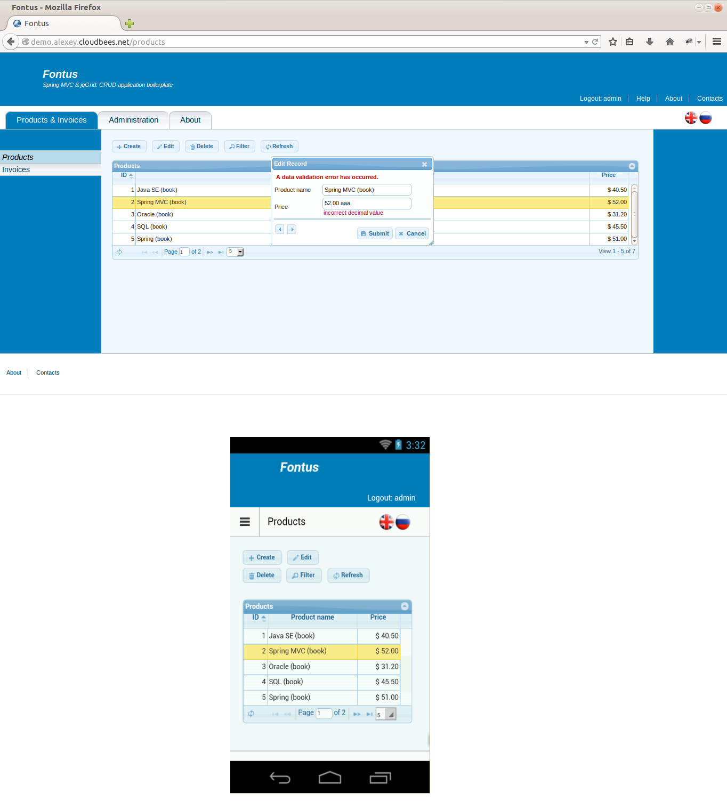

##Fontus

**_Spring MVC &amp; jqGrid: a CRUD application boilerplate_**

###Introduction

This project is a template/demo of a CRUD web application. It uses Spring Web MVC (a Java web framework) and jqGrid (an open source JavaScript grid). The application features internationalisation, user authentication/authorisation, RESTful web services, support for mobile browsers and a few more things that can be found in many web applications. It's my study project. I have published it [on GitHub](https://github.com/iexel/fontus) in a hope that it may be useful to someone as a boilerplate for a new application or as a demo application that showcases the use of Spring MVC and jqGrid.

Why is it called Fontus? In the ancient Roman religion, Fontus was the god of wells and springs.

###Screenshots



###Online deployment

~~You can check this web application online at http://demo.alexey.cloudbees.net~~. CloudBees closed its application hosting servise. The site will be moved to another hosting provider.

###Licensing

This project is released under the [Apache Software License, Version 2.0](https://github.com/iexel/fontus/blob/master/LICENSE). All third party libraries used in the project are both Free and Open Source software. Most of the third-party images are in the Public Domain. A document that lists all third party components of the application and addresses their license requirements is included in both the source code distribution ([here](https://github.com/iexel/fontus/blob/master/third-party-licenses.md)), and into the deployed application ([here](http://demo.alexey.cloudbees.net/credits)). The list of third-party artifacts and their licenses is build semi-automatically with a help of the License Maven Plugin and a [custom FreeMaker template](https://github.com/iexel/fontus/blob/master/license-maven-plugin-template.ftl).

###Building the project

The application is a multi-module Maven project which consists of a parent and two child projects. Use `mvn clean package` to build the project, or `mvn clean verify` to build the project and run the integration tests. FireFox should be installed on the build computer to run the integration tests.

###Technologies used in this application

####Short list of technologies

Spring MVC, Java EE, RESTful Web Services, JPA, Hibernate, MySQL, HyperSQL, JSON, JSP, JSTL, HTML5, CSS3, jQuery, jQuery UI, JavaScript, AJAX, Tomcat, Maven, Selenium, Spring MVC Test Framework, JUnit, Mockito, Hamcrest.

####Server-side web development (Java EE & Spring MVC 4.0)

The Spring MVC 4.0 framework is used in the application. Spring MVC is one of the most popular Java web frameworks (probably, the most popular). JSP pages (with JSTL and EL) are used as the view technology.

####RESTful web services

RESTful web services are implemented with Spring MVC 4.0. The web services are used for two purposes:
- to handle AJAX requests
- as an external API

####JqGrid 4.5.4

jqGrid is an open source AJAX data grid which is based on jQuery and jQuery UI. It renders a grid using JavaScript (the HTML just defines two `<div>` tags as a point of attachment for the grid). The grid uses a RESTful web service  for CRUD operations. As jqGrid is based on jQuery UI, its look can be customised with jQuery UI themes.

The configuration and customisation of jqGrid is one of the most interesting parts of this demo application as it's an example of Spring MVC/jqGrid integration. The customised grid has the following features:
- It uses RESTful web services (RESTful URLs, `GET`/`POST`/`PUT`/`DELETE` HTTP methods, JSON responses).
- It can display server side data validation errors generated by Spring MVC.
- It correctly handles AJAX error responses.
- It is tuned (with CSS and JavaScript) to have an acceptable look in all major browsers.
- Some other things...

####Hierarchical templating

Each web page consists of hierarchical blocks (header, footer, menu, master-page, etc.). JSP `.tag` files are used for templating (as an alternative to third party frameworks such as Apache Tiles). See [this](http://stackoverflow.com/a/3257426/2842067) StackOverflow answer for details on using `.tag` files for templating.

####Authentication and authorisation

Spring Security 3.2 framework is used to restrict user access to web pages and web servises on per-role basis. Some pages change their appearance depending on the user's permissions.

####Internationalisation and localisation

The application has been internationalised (the capabilities of Spring MVC are used for internationalisation) and localised for two languages.

####User input validation

User input is validated server-side (with Spring MVC and JSR-303). I explained how validation errors are displayed in jqGrid in [this](http://stackoverflow.com/q/21808706/2842067) StackOverflow question.

####Error processing

On the server side, most of the Java exceptions (including business exceptions and user input validation exceptions) are handled with Spring MVC (the `@ExceptionHandler` annotation). The errors and exceptions that cannot be handled with Spring MVC are handled the JSP/Java EE way: with the mapping in the `web.xml` file.

If an error happens while the web server is processing a request that should return a complete HTML page, the user is redirected to an error page. If an error happens while an AJAX request is processed, the server returns JSON that describes the error. On the client side, depending on the severity of the error, the error is either processed centrally (and the user is shown a dedicated error page) or locally (the user is shown an error message but stays on the current page).

“Session has expired” errors result in redirecting to the login page.

####JavaScript libraries

The following third-party JavaScript libraries are used in the application: jQuery, jQuery UI, jqGrid, mmenu, and Layout Engine. The use of jQuery UI is limited; most of the HTML is manually coded, and styled with CSS.

####Mobile phones and tablets

The application has a fluid and responsive HTML layout which adapts well to mobile phone and tablet screens. The responsiveness is implemented using CSS media queries. A separate compact mobile menu is used on narrow screens.

####Logging framework

The application uses slf4j API with log4j implementation for logging.

####Web server

The application has been tested in Tomcat 7. It should work in any other servlet container/Java EE application server.

####DB access

The Hibernate implementation of JPA is used for DB access. The deployed application uses MySQL. The integration tests employ an in-memory DB (HyperSQL).

####Browser compatibility

Supported desktop browsers: the current version and the second last version of FireFox, Chrome and Opera; Safari 5.0+, IE 9+

Mobile browsers: Android Browser (AOSP) 2.3+, Chrome for Mobile; Mobile Safari (partly)
 
####Regression testing

The project employs the following tests:
 - GUI integration tests (Selenium, JUnit, Hamcrest)
 - Integration tests for the RESTful web service (JUnit, Hamcrest, JasonPath, Spring MVC Test Framework)
 - Unit tests for Spring MVC controllers - web pages and the RESTful web service (JUnit, Mockito, Hamcrest, Spring MVC Test Framework)

####Import to Eclipse and deployment to Tomcat

After importing the three Maven projects to Eclipse:
 - Change the encoding to `UTF-8` in the properties of localisation files (`messages_ru.properties` and `messages.properties`). Spring MVC is configured to read these files in `UTF-8`.
 - Exclude the content of the `fontus-web/src/main/webapp/resources/js/libs/` directory from JavaScript validation (third-party libraries tend to produce validation warnings). In the `fontus-web` project properties select `JavaScript` > `Include Path`, click the `Source` tab, select the `Excluded` node, press `Edit...` button, and add the directory into the `Exclusion patterns` section.
 - Add the following JNDI data source in the `context.xml` file in your Tomcat installation (see [this document](http://tomcat.apache.org/tomcat-7.0-doc/jndi-resources-howto.html) for the full list of the data source options):
```xml
    <Context>
	    <Resource name="jdbc/FONTUS"
		    auth="Container"
		    type="javax.sql.DataSource"
		    driverClassName="com.mysql.jdbc.Driver"
		    url="jdbc:mysql://localhost:3306/YOUR_DB_NAME?useUnicode=yes&amp;characterEncoding=UTF-8"
		    username="your_user_name"
		    password="your_password" />
    </Context>
```
