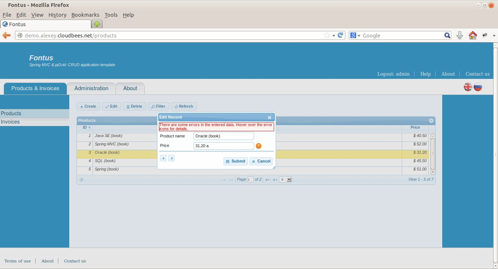

##Fontus

**_Spring MVC &amp; jqGrid: a CRUD application template/demo_**

###Introduction

This project is a template/demo of a CRUD web application. It uses Spring Web MVC (a Java web framework) and jqGrid (an open source JavaScript grid). The application features internationalisation, user authentication/authorisation, RESTful web services and a few more things that can be found in almost any web application. It's my study project. I have published it in a hope that it may be useful to someone as a boilerplate for a new application or as a demo application that showcases the use of Spring MVC and jqGrid.

Why is it called Fontus? In the ancient Roman religion, Fontus was a god of wells and springs.

###Online deployment

You can check this web application online at http://demo.alexey.cloudbees.net (login: `admin`, password: `admin` for access to the protected pages). Usually, the first access to the URL is very slow as the server hibernates the application when it is not used. The free Java EE hosting at CloudBees provides very limited resources in other respect as well.

###Building the project

The application consists of two child Maven projects included in a parent project. Issue `mvn clean package` from the parent project directory to build the application.

###Technologies used in this application

####Short list of technologies

**Spring MVC, Java EE, RESTful Web Services, JSON, JSP, JSTL, HTML5, CSS3, jQuery, jQuery UI, JavaScript, AJAX, Tomcat, Maven**

####Server-side web development (Java EE & Spring MVC 4.0)

The Spring MVC 4.0 framework is used in the application. Spring MVC is one of the most popular Java web frameworks (probably, _the_ most popular). JSP pages (with JSTL and EL) are used as the view technology.

####RESTful web services

RESTful web services are implemented with Spring MVC 4.0. The web services are used for two purposes:
- to handle AJAX requests
- as an external API

####JqGrid 4.5.4

jqGrid is an open source AJAX data grid which is based on jQuery and jQuery UI. It renders a grid using JavaScript (the source HTML page just need to define two `
` tags as a point of attachment for the grid). The grid uses a RESTful web service  for CRUD operations (i.e. to obtain and update its data). As jqGrid is based on jQuery UI, its look can be customised with jQuery UI themes.

The configuration and customisation of jqGrid is one of the most interesting parts of this demo application as it's an example of Spring MVC/jqGrid integration. The customised grid has the following features:
- It uses a RESTful web service with the following characteristics: RESTful URLs, four web methods (`GET`, `POST`, `PUT`, `DELETE`), JSON responses (the default configuration is different). The service consumes  `application/x-www-form-urlencoded` data. jqGrid can be customised to use a service that consumes JSON; however, JSON is harder to validate with Spring MVC as discussed in my StackOverflow question [here](http://stackoverflow.com/q/21793584/2842067).
- It can display server side data validation errors generated by Spring MVC.
- It correctly handles AJAX error responses.
- It is tuned (with CSS and JavaScript) to have an acceptable look in all major browsers.
- Some other things...

####Templating framework

Web pages consist of hierarchical blocks (header, footer, menu, master-page, etc.). JSP tag files (`.tag`) are used for templating (as an alternative to third party frameworks such as Apache Tiles). See [this](http://stackoverflow.com/a/3257426/2842067) StackOverflow answer for details on using the tag files for templating.

####Authentication and authorisation

Spring Security 3.2 framework is used to define user access to a web-page on per-role basis. Some pages change their appearance depending on the user's permissions.

####User input validation

User input is validated server-side (with Spring MVC and JSR-303). I explained how validation errors are displayed in jqGrid in [this](http://stackoverflow.com/q/21808706/2842067) StackOverflow question.

####Error processing

On the server side, most of the Java exceptions (including business exceptions and user input validation exceptions) are handled with Spring MVC (the `@ExceptionHandler` annotation). The errors and exceptions that cannot be handled with Spring MVC are handled the JSP/Java EE way: with the mapping in the `web.xml` file.

If an error happens while the web server processes a request that should return a complete HTML page, the user is redirected to an error page. If an error happens while an AJAX requests is processed, the server returns JSON that describes the error. On the client side, depending on the severity of the error, the error is either processed centrally (and the user is shown a dedicated error page) or locally (the user is shown an error message but stays on the current page).

“Session has expired” errors result in redirecting to the login page.

####JavaScript libraries

Three JavaScript libraries are used in the application: jQuery, jQuery UI, and jqGrid. The use of jQuery UI is limited; most of the HTML is manually written and styled with CSS.

####Logging framework

The application uses slf4j API with log4j implementation for logging.

####Web server

The application was tested in Tomcat 7. It should work in any other servlet container/Java EE server.

####DB

In-memory dummy service is used instead of a DB.

####Browser compatibility

The application was tested in four major browsers: FireFox, Opera, Chrome and IE (on Linux and Windows).

####Import to Eclipse

After importing the three Maven projects to Eclipse, two additional steps should be taken:
- If code in JavaScript libraries does not validate, exclude the libraries from validation: `JavaScript` > `Include Path` in project properties.
- In the properties of localisation files (`messages_ru.properties` and `messages.properties`) change their encoding to `UTF-8` (Spring MVC is configured to read these files in `UTF-8`).

###Screenshot

